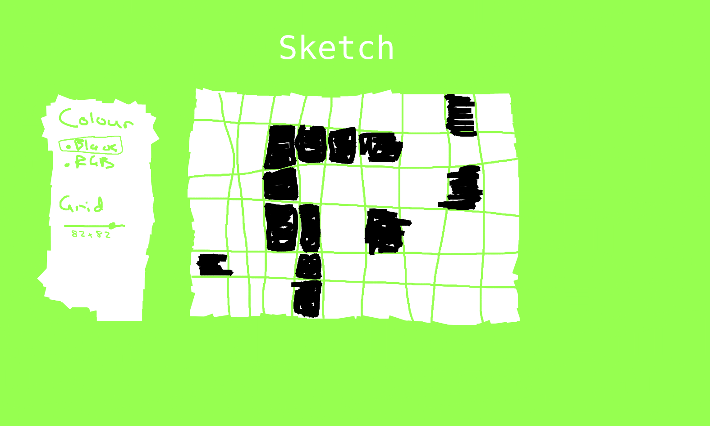

# etch-a-sketch

This project is part of 'The Odin Project' foundations javascript course. It's a browser version of a sketchpad/Etch-A-Sketch. 

I'll be using plain old HTML, CSS and JS. This will be a sweet opportunity to practice CSS flexbox/grid, and DOM manipulation with JS.

## Plan

### Initial Project Scope:

- 16x16 Grid (CSS Grid?)
- Generate grid with JS
- Black sketching only
- Clear function
- Minimal styling (focus on core JS functionality)
- Unresponsive design

### Advanced Scope:

- Resizeable grid (up to 128x128??)
- Nice looking web page with CSS
- Selectable colours for sketching (random RGB sketching?)
- Responsive, mobile first design? (revisit when learning responsive design?)

#### Rough design (ignore colours)

